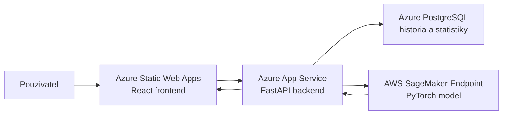

# Dokumentacia projektu

## Nazov projektu

Car Brand Detection WebApp

## Slovny rozbor a analyza ulohy

Cielom projektu je vytvorit webovu aplikaciu, ktora umozni pouzivatelovi nahrat obrazok auta a ziskat predikciu znacky vozidla. Aplikacia ma byt dostupna cez webove rozhranie, spracovat vstupny obrazok, zavolat model strojoveho ucenia a zobrazit vysledok spolu s mierou istoty. Suvisiace vysledky sa ukladaju do databazy, aby bolo mozne zobrazit historiu detekcii a jednoduche statistiky.

Uloha je rozdelena na viac casti:

- frontend pre pouzivatelske rozhranie,
- backend API pre prijatie obrazka, validaciu vstupu, komunikaciu s modelom a ukladanie vysledkov,
- databaza pre perzistentne ulozenie historie,
- cloud hosting aplikacie,
- samostatny hosting AI modelu.

Podla zadania je aplikacna cast nasadena v Azure, zatial co model je hostovany v AWS SageMaker. Backend teda model nespusta lokalne v Azure, ale posiela obrazok na SageMaker endpoint a spracuje odpoved modelu.

Vstupom aplikacie je obrazok auta vo formate JPG, PNG alebo WEBP. Vystupom je predikovana znacka auta, confidence score a zoznam top 5 najpravdepodobnejsich znaciek. Model povodne rozlisuje triedy typu znacka, model a rok, ale aplikacia agreguje vysledky na urovni znacky, pretoze cielom riesenia je detekcia automobilovej znacky.

## Odovodnenie zvolenych technologii

### React a Vite

Frontend je implementovany v Reacte a buildovany cez Vite. React je vhodny na komponentove webove rozhranie s viacerymi obrazovkami, napriklad detekcia, historia a statistiky. Vite bol zvoleny pre jednoduchy development setup, rychly lokalny server a jednoduchy produkcny build.

### FastAPI

Backend je implementovany vo FastAPI. FastAPI je vhodne pre REST API v Pythone, podporuje jednoduche spracovanie uploadov suborov, validaciu vstupov a rychlu integraciu s Python kniznicami. Pre tento projekt je vhodne aj preto, ze backend komunikuje s AWS cez Python SDK `boto3`.

### Azure App Service

Backend je nasadeny na Azure App Service. Tato sluzba umoznuje jednoduche hostovanie Python web API bez nutnosti spravovat vlastny server. Environment variables sa nastavuju priamo v Azure konfiguracii, co je vhodne pre databazove connection stringy a AWS pristupove udaje.

### Azure Static Web Apps

Frontend je nasadeny na Azure Static Web Apps. Ide o vhodnu sluzbu pre staticky frontend build z React/Vite aplikacie. Frontend po builde pozostava zo statickych suborov, ktore komunikuju s backendom cez HTTP API.

### Azure PostgreSQL

Databaza je realizovana cez Azure PostgreSQL. PostgreSQL bol zvoleny ako spolahliva relacna databaza na ulozenie historie detekcii, confidence hodnot a casovych udajov. Backend pouziva SQLAlchemy, co zjednodusuje pracu s databazou z Pythonu.

### AWS SageMaker

AI model je hostovany na AWS SageMaker endpoint-e. SageMaker bol zvoleny, pretoze je urceny na produkcne hostovanie modelov strojoveho ucenia a poskytuje HTTP endpoint pre inferenciu. V projekte je pouzity serverless endpoint, aby nebolo nutne spravovat instanciu a aby sa znizili naroky na konfiguraciu.

### PyTorch

Model je PyTorch classifier. PyTorch je bezna kniznica pre trenovanie a spustanie modelov strojoveho ucenia. V SageMaker casti sa pouziva inference skript, ktory nacita model, spracuje obrazok a vrati vysledok vo forme JSON.

## Diagram pouzitych sluzieb a prepojenia



Popis komunikacie:

1. Pouzivatel nahra obrazok auta vo frontende.
2. Frontend posle obrazok na endpoint `POST /api/detect` v Azure backend-e.
3. Backend validuje typ suboru a posle binarne data obrazka na AWS SageMaker endpoint.
4. SageMaker endpoint vykona inferenciu a vrati predikovanu znacku auta.
5. Backend ulozi vysledok do Azure PostgreSQL.
6. Frontend zobrazi znacku, confidence score a top 5 predikcii.

## Funkcnost riesenia

Aplikacia poskytuje tieto hlavne funkcie:

- upload obrazka auta,
- detekcia znacky vozidla pomocou modelu na AWS SageMaker,
- zobrazenie hlavnej predikcie a confidence score,
- zobrazenie top 5 znaciek,
- ulozenie detekcie do databazy,
- zobrazenie historie detekcii,
- zobrazenie zakladnych statistik.

## Prispevok jednotlivych clenov timu

Doplnit podla realneho zlozenia timu:

| Clen timu | Prispevok |
| --- | --- |
| Lukáš Švihura | Implementacia backend API vo FastAPI, integracia s databazou, endpointy `/api/detect`, `/api/history`, `/api/stats` Azure deployment, konfiguracia App Service, Static Web Apps, PostgreSQL a environment variables.. |
| Dominik Keil | Implementacia React frontendu, upload obrazka, zobrazenie vysledkov, historia a statistiky. |
| Erik Tóth | Priprava a nasadenie modelu na AWS SageMaker, inference skript, konfiguracia endpointu. |


Ak projekt robil jeden clen, tabulku je mozne upravit na jeden riadok a spojit vsetky uvedene cinnosti.

## Dokumentacia k pouzivaniu aplikacie

### Poziadavky

Pre lokalne spustenie su potrebne:

- Python 3.10 alebo kompatibilna verzia,
- Node.js a npm,
- pristup k Azure PostgreSQL alebo lokalna databaza,
- AWS credentials s pravom volat SageMaker endpoint,
- existujuci AWS SageMaker endpoint `car-brand-classifier-endpoint`.

### Environment variables backendu

Backend pouziva tieto produkcne premenne:

```text
DATABASE_URL=postgresql://...
FRONTEND_URL=https://<frontend>.azurestaticapps.net
AWS_REGION=eu-central-1
SAGEMAKER_ENDPOINT_NAME=car-brand-classifier-endpoint
AWS_ACCESS_KEY_ID=<aws-access-key>
AWS_SECRET_ACCESS_KEY=<aws-secret-key>
```

Ak sa pouzivaju docasne AWS credentials, doplni sa aj:

```text
AWS_SESSION_TOKEN=<temporary-session-token>
```

Tieto hodnoty sa nenahravaju do Git repozitara. V Azure sa nastavuju v konfiguracii App Service.

### Spustenie backendu lokalne

```powershell
cd backend
py -3.10 -m venv venv
.\venv\Scripts\Activate.ps1
pip install -r requirements.txt
uvicorn app.main:app --reload
```

Backend je potom dostupny na:

```text
http://localhost:8000
```

Zakladny health check:

```powershell
curl.exe http://localhost:8000/api/health
```

Ocakavany vystup:

```json
{"status":"ok"}
```

### Spustenie frontendu lokalne

```powershell
cd frontend
npm install
npm run dev
```

Frontend je potom dostupny na:

```text
http://localhost:5173
```

### Test SageMaker endpointu

Priamy test AWS endpointu:

```powershell
py -3.10 -c "import boto3; body=open('C:/cesta/k/autu.png','rb').read(); r=boto3.client('sagemaker-runtime', region_name='eu-central-1').invoke_endpoint(EndpointName='car-brand-classifier-endpoint', ContentType='image/png', Accept='application/json', Body=body); print(r['Body'].read().decode('utf-8'))"
```

Priklad vystupu:

```json
{
  "top_prediction": "Toyota",
  "confidence": 13.97,
  "brand": "Toyota",
  "model_name": null,
  "year": null,
  "top5": [
    {"brand": "Toyota", "class_name": "Toyota", "confidence": 13.97},
    {"brand": "Ford", "class_name": "Ford", "confidence": 11.35}
  ]
}
```

### Test backend detekcie

Lokalne:

```powershell
curl.exe -X POST "http://localhost:8000/api/detect" -F "file=@C:/cesta/k/autu.png"
```

Na Azure:

```powershell
curl.exe -X POST "https://<backend>.azurewebsites.net/api/detect" -F "file=@C:/cesta/k/autu.png"
```

### Vstupy

Podporovane vstupne formaty:

- JPEG,
- PNG,
- WEBP.

Vstupom je obrazok, na ktorom je viditelne auto. Kvalita vysledku zavisi od kvality obrazka, uhla pohladu, viditelnosti loga a podobnosti auta s datami, na ktorych bol model trenovany.

### Vystupy

Endpoint `/api/detect` vracia JSON:

```json
{
  "id": 1,
  "top_prediction": "Mercedes-Benz",
  "confidence": 33.66,
  "brand": "Mercedes-Benz",
  "model_name": null,
  "year": null,
  "top5": [
    {"brand": "Mercedes-Benz", "class_name": "Mercedes-Benz", "confidence": 33.66},
    {"brand": "BMW", "class_name": "BMW", "confidence": 10.45}
  ],
  "created_at": "2026-04-27T15:48:06"
}
```

Endpointy aplikacie:

| Endpoint | Metoda | Popis |
| --- | --- | --- |
| `/api/health` | GET | Overenie, ze backend bezi. |
| `/api/detect` | POST | Detekcia znacky auta z obrazka. |
| `/api/history` | GET | Historia predchadzajucich detekcii. |
| `/api/stats` | GET | Statistiky detekcii. |

## Nasadenie

### AWS SageMaker

Model sa nasadi pomocou skriptu:

```powershell
py -3.10 sagemaker\deploy_to_sagemaker.py `
  --serverless `
  --serverless-memory 3072 `
  --serverless-concurrency 1 `
  --region eu-central-1 `
  --endpoint-name car-brand-classifier-endpoint `
  --role arn:aws:iam::<account-id>:role/SageMakerExecutionRole
```

### Azure backend

Backend sa nasadi na Azure App Service. V konfiguracii App Service musia byt nastavene environment variables uvedene vyssie.

Start command:

```text
gunicorn app.main:app --workers 1 --worker-class uvicorn.workers.UvicornWorker --bind 0.0.0.0:8000 --timeout 120
```

### Azure frontend

Frontend sa nasadi na Azure Static Web Apps.

Build command:

```text
npm run build
```

Build output:

```text
frontend/dist
```

Frontend potrebuje premennu:

```text
VITE_API_URL=https://<backend>.azurewebsites.net
```

## Bezpecnostne poznamky

- AWS access key a secret key sa nesmu commitovat do Git repozitara.
- `.env` subory su ignorovane cez `.gitignore`.
- Modelovy subor `model.pth` je velky a nepatri do Git repozitara.
- SageMaker endpoint moze generovat naklady, preto ho treba po odovzdani alebo teste vypnut.

Vymazanie SageMaker endpointu:

```powershell
py -3.10 sagemaker\delete_endpoint.py `
  --endpoint-name car-brand-classifier-endpoint `
  --region eu-central-1 `
  --delete-config `
  --delete-model
```
